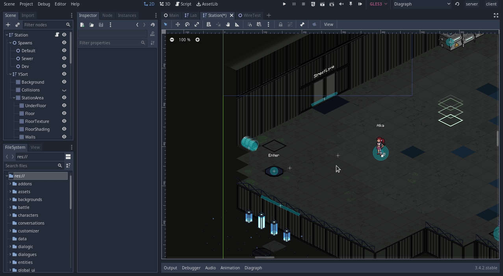

# Selection Shortcuts

This plugin provides various useful shortcuts for working with 2d nodes.

# Move Selection to Cursor

Pressing `ctrl+f` moves the selected Node(s) to the cursor. This works with one or multiple nodes, and correctly adds all of its actions to the editor's Undo/Redo.

# RTS Shortcuts

This feature adds a number of Real Time Strategy game inspired shortcuts:

## Selection Groups

Pressing `ctrl` + a number key stores the current selection.

Pressing a number key reselects the saved group.

These selection groups are saved per scene.

## NodePath Selection

In the editor settings under `Interface/Selection Shortcuts` are a set of fields where you can enter a `NodePath` or a list of `NodePath`s, seperated by commas.

Pressing `ctrl+shift` + a number key will attempt to find the nodes in the current scene, and if successful, selects them.

These selections are global, not per-scene.

This can be useful when doing level design, for instance. In my game, all the levels have a node named `Spawns` that holds all of that level's spawn points. There's a special spawn point named `Dev`, that we use as a shortcut to spawn directly in the region we're working on. I put `Spawns/Dev` as one of my `NodePath` selections, so I can press `ctrl+shift+1` in any of my levels to select the dev spawn point.

I find this is especially useful when combined with the `ctrl+f` shortcut from above, so with two keypresses I can select the dev spawn and move it directly to my cursor.

